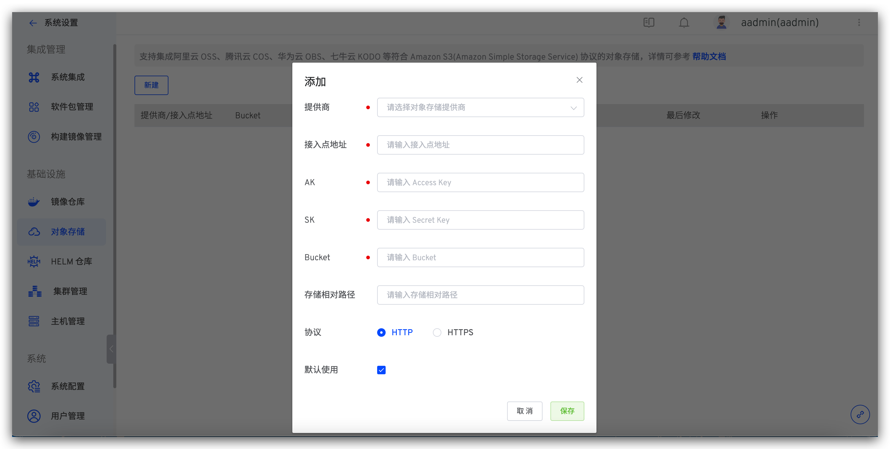
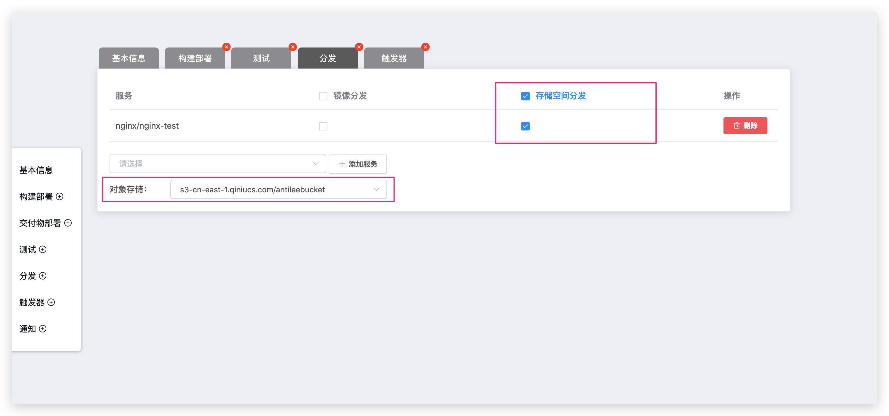

本文介绍如何在 Zadig 系统上集成和使用对象存储。

> 对象存储支持标准的 `Amazon S3`[(Amazon Simple Storage Service)](https://docs.aws.amazon.com/zh_cn/AmazonS3/latest/userguide/Welcome.html)协议，通过 Zadig 系统，可以对所有支持 `Amazon S3` 第三方服务提供商进行对接，包括但不限于 Amazon、阿里云、腾讯云、华为云、七牛云等云厂商。

:::tip
配置对象存储，系统可以自动把工作流构建任务历史日志、构建工作空间缓存、测试任务历史日志、测试报告存储到对象存储空间中。
:::
## 添加对象存储

点击 `系统设置` -> `对象存储` -> `新建`：

参数说明：

- `接入点地址`：S3 服务入口地址，具体参阅服务商文档
- `AK`：服务商提供的 Access Key
- `SK`：服务商提供的 Secret Key
- `Bucket`：空间名称
- `存储相对路径`：存放在空间中文件的前缀 `$Prefix`
- `协议`：使用 HTTP 或者是 HTTPS 协议
- `默认使用`：是否为默认使用的配置，同一类型的对象存储支持配置多个，但仅有一个会生效

## 工作流分发使用对象存储

> 通过配置对象存储，用户可以把构建过程产生的软件包通过工作流的分发步骤，分发到对象存储空间中。

编辑带有分发步骤的工作流，可以通过勾选 `存储空间分发` 将对应服务构建产生的软件包分发到存储空间，如下图所示。

