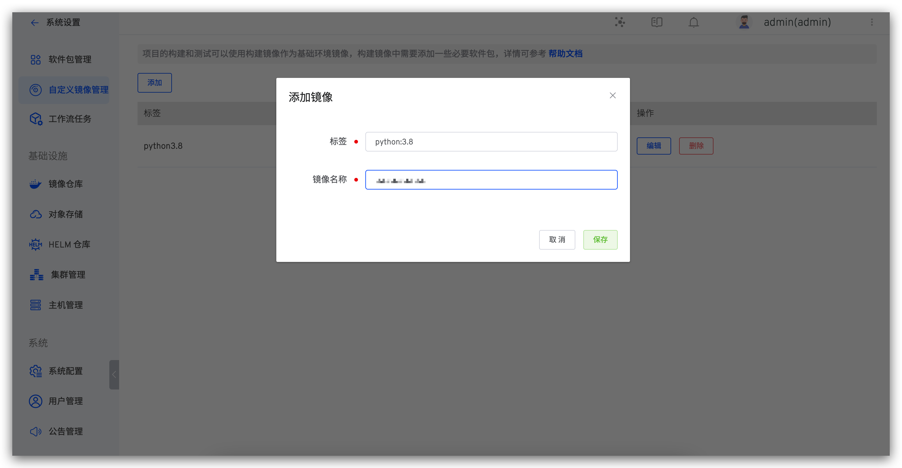

本文介绍在 Zadig 系统上如何使用自定义镜像作为构建、测试和代码扫描的基础运行环境。如果构建、测试、代码扫描过程需要安装很多工具和依赖，那么把这些工具和依赖事先打包成一个自定义镜像，在执行构建、测试或者代码扫描时使用它，这样做可以大大提升任务的执行效率。

## 步骤 1：生成自定义镜像

- 编写 Dockerfile，根据实际需求，添加 docker 指令。

::: danger
使用自定义镜像时，需要确保在镜像中安装了 Zadig 系统需要的依赖，否则可能无法正常执行。<br>
所需依赖如下：
1. curl：获取网络资源
2. git：用于执行 git 命令，获取构建代码（请确保安装 2.11.0 以上版本）
3. tzdata：保持容器时间同步

除上述依赖外，构建模块使用的自定义镜像还需安装以下依赖：
-  docker cli：用于执行 docker 命令，必须安装在 `/usr/local/bin` 目录下。

除上述依赖外，代码扫描模块使用的自定义镜像还需安装以下依赖：
- Java(Oracle JRE or OpenJDK) 
- sonar-scanner
:::

可参考以下两个 ubuntu:focal 和 centos:7.8.2003 样例，编写您自己的 Dockerfile :

```dockerfile
FROM ubuntu:focal

# 在此可添加自定义指令

# 以下是 Zadig 所需要的依赖

# 安装工具 curl git tzdata
RUN sed -i -E "s/[a-zA-Z0-9]+.ubuntu.com/mirrors.aliyun.com/g" /etc/apt/sources.list
RUN apt-get clean && apt-get update && DEBIAN_FRONTEND=noninteractive apt-get install -y curl git tzdata

# 修改时区
RUN ln -sf /usr/share/zoneinfo/Asia/Shanghai /etc/localtime

# 安装 docker client
RUN curl -fsSL "http://resources.koderover.com/docker-cli-v19.03.2.tar.gz" -o docker.tgz &&\
    tar -xvzf docker.tgz &&\
    mv docker/* /usr/local/bin
```

```dockerfile
FROM centos:7.8.2003

# 在此可添加自定义指令

# 以下是 Zadig 所需要的依赖

# 安装工具 curl git tzdata
RUN yum -y install curl git tzdata

# 修改时区
RUN ln -sf /usr/share/zoneinfo/Asia/Shanghai /etc/localtime

# 安装 docker client
RUN curl -fsSL "http://resources.koderover.com/docker-cli-v19.03.2.tar.gz" -o docker.tgz &&\
    tar -xvzf docker.tgz &&\
    mv docker/* /usr/local/bin
```

- 构建镜像，可参考以下命令

```bash
docker build -t name:tag -f Dockerfile .
```

- 将上一步生成的镜像推送到公开镜像仓库或者已经集成到 Zadig 系统中的私有镜像仓库

```bash
docker push name:tag
```

## 步骤 2：创建自定义镜像

点击 `系统设置` ->`自定义镜像管理` -> `添加`，如下图所示：



参数说明：
- `标签`：请填写一个可用于辨认镜像的名称
- `镜像名称`：请填写之前上传到镜像仓库的镜像名称，需要填写完整的镜像名称，如 ccr.ccs.tencentyun.com/namespace/imageName:tag

## 步骤 3：使用自定义镜像

自定义镜像可以在构建、测试和代码扫描模块中使用，下面以构建模块为例。

进入项目下的构建 -> 点击添加，即可在 `操作系统` 选项中使用自定义镜像，在执行构建任务时，即可使用您的自定义镜像作为操作系统


