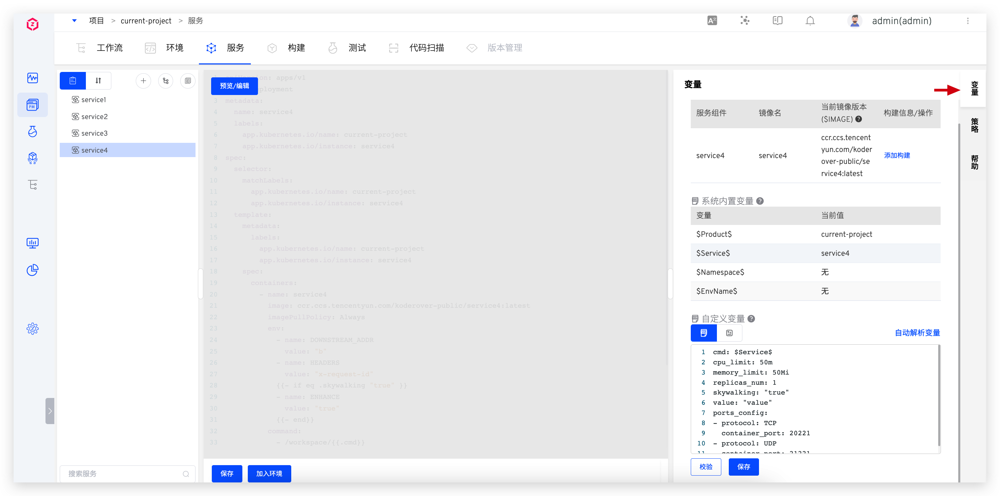
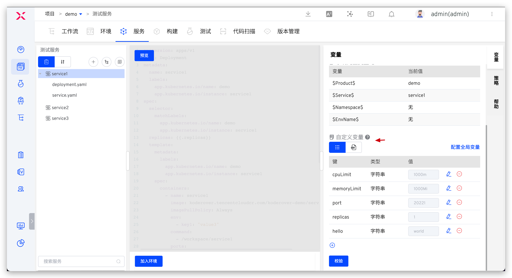
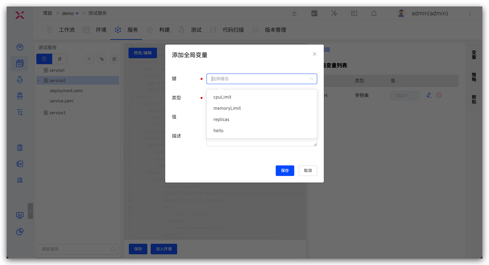
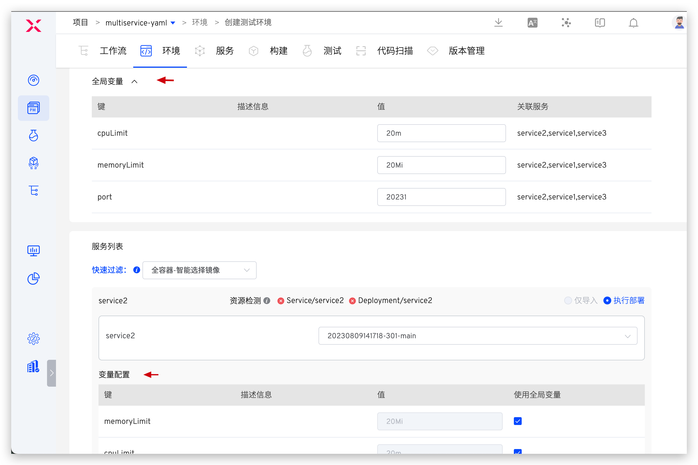

本文主要介绍 K8s YAML 项目中的服务变量功能。

## 变量配置
选中服务，点击右侧的`变量`进入到服务变量配置页面。包括系统内置变量、自定义变量和全局变量。

- 系统内置变量和自定义变量可在服务 YAML 配置中进行引用
- 服务的 YAML 配置中，容器名称和镜像信息不可使用内置变量 `$Namespace$` 和 `$EnvName$`
- 支持配置全局变量，创建环境时可按需对默认值做覆盖，实现不同环境的差异化配置



### 系统内置变量
包括 `$Namespace$`、`$Product$`、`$Service$`、`$EnvName$`，可直接在 YAML 中进行引用，具体说明如下：
- `$Namespace$`：项目创建的环境所在的 K8s 空间名称
- `$Product$`：项目名称
- `$Service$`：服务名称
- `$EnvName$`：创建的环境名称

### 自定义变量
- 服务的 YAML 配置文件中形如 <span v-pre>`{{.Key}}`</span> 的内容可以自动解析为自定义变量。
- 点击自定义变量下方的`键值对`、`YAML 文件`图标可切换变量视图。
- 可修改服务变量的类型及默认值并校验正确性，支持字符串、枚举、布尔、YAML 四种类型。



### 全局变量
点击自定义变量右侧的`配置全局变量`进行配置。


添加全局变量，默认可选的键来自于所有服务的自定义变量（键名相同的变量视为同一个），也可以输入自定义键名来添加。



## 变量的使用

### 创建环境

在创建环境时，可配置服务变量和环境全局变量，对服务配置中的变量默认值做覆盖，实现不同环境的差异化配置。

1. 需要事先在服务中配置全局变量，创建环境时才可配置环境级别的全局变量
2. 支持使用系统内置变量来为全局变量和服务变量赋值
3. 只有和待创建环境服务列表中服务有关联的全局变量才可以在创建环境时指定
4. 为服务配置变量值，可以自定义，或者一键勾选使用环境的全局变量



### 更新环境全局变量

在环境中，点击`更新全局变量`，可更新对应环境中的全局变量。

1. 环境的全局变量在当前环境下生效
2. 修改全局变量的值后，和全局变量有关联的服务将会自动更新，应用最新的变量值。
3. 支持删除和服务无关联的全局变量
4. 支持添加新的全局变量，待添加的变量需要先在服务的全局变量中定义


### 更新服务变量

在环境中添加服务或更新服务时，可对服务变量进行修改，支持手动修改或使用环境全局变量。更新服务时，同时可以通过勾选 `更新服务配置`，选择是否更新当前服务的 YAML 版本。


## 变量示例

以下述 YAML 配置文件为例说明：

1. 第 4、11 行引用内置变量 `$Product$`，无需赋予默认值，在创建环境时内置变量会被自动渲染替换
2. 第 7 行引用自定义变量 <span v-pre>`{{.portal_host}}`</span>，在创建环境时可以使用默认值也可以再次修改

```yaml
apiVersion: extensions/v1beta1
kind: Ingress
metadata:
  name: $Product$-index  // 使用系统内置变量 $Product$，环境创建时被渲染
spec:
  rules:
  - host: {{.portal_host}} // 使用自定义变量 {{.portal_host}}，环境创建时被渲染
    http:
      paths:
      - backend:
          serviceName: $Product$-index
          servicePort: 80
        path: /
        ...更多内容省略...
```

## 最佳实践参考

利用服务的变量能力实现不同环境的差异化配置，最佳实践参考如下：

- [数据库隔离](/ZadigX%20v1.6.0/env/multi-env/#数据库隔离)
- [域名区分](/ZadigX%20v1.6.0/env/multi-env/#域名区分)
